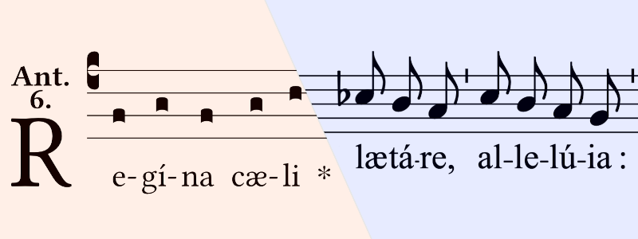

# Editoris Melicorum (EMEL)

Editors of Melodies - GSI's music typesetting toolkit

Part of the FAVI System: https://github.com/guild-st-isidore-TO/fabrica-virtualis

---

> STATUS (XXVIII Aprilis MMXXVI)  
Active Development -- Refactoring this into a Poetry project for better portability and collaboration

EdiMeli is a digital music typesetting toolkit for music ministries in Catholic parishes. The toolkit helps build musical arrangements around traditional hymns in Gregorian notation. As well as laying them out into documents, both for the congregation and the choir/musicians.

For more info, check out [this PDF handout on `EMEL v0.0.7`](./docs/static/emel-antiphons-1.1.pdf)

### Examples

Different sheet types for the same hymn:

1. [Complete guitar](./docs/static/marian-antiphons-simple-all-v0.8.pdf)
1. [Guitar accompanist](./docs/static/marian-antiphons-simple-accomp-v0.8.pdf)
1. [Guitar soloist](./docs/static/marian-antiphons-simple-solo-v0.8.pdf)

## LOCAL USAGE

1. Be in the root directory of this repo
1. Run `python3 src/editorismelicorum/editor_melicus.py`

### Setup

#### Requirements

**gabctk** -- GABC conversion toolkit

https://github.com/jperon/gabctk/blob/master/README-en.md

**LilyPond** -- Digital music typesetting

https://lilypond.org/download.html

#### Suggestions

**Frescobaldi** -- Lilypond viewer and editor

https://github.com/frescobaldi/frescobaldi/wiki

## CONFIGURATION

...

## DESIGN

### Philosophy

The module can be thought of as a publishing house (**Editoris Melicorum**) run by several people:

1. **Editor**, _(in Chief)_  
Sets up jobs, sends deliverables
1. **Lector**, _the Reader_  
Reads source documents, prepares them for further arrangement
1. **Scriptor**, _the Writer (Engraver)_  
Combines source documents and prepared arrangements, and engraves new copies
1. **Scholasticus**, _the Scholar_  
Knowledge resource for the rest of the team

The module has been structured to reflect these personas and their division of responsibilities.

### Data Flow

## CONTRIBUTING

Want to contribute to the _Editoris_ project? Shoot an email to `salvador.workshop@gmail.com`

## Notes

- The ``(`)`` symbol in GABC input code causes errors in `gabctk`, and should be removed
